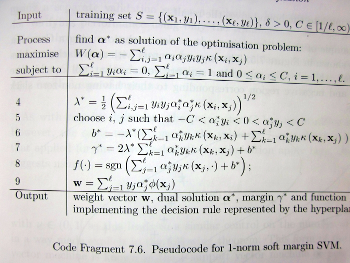
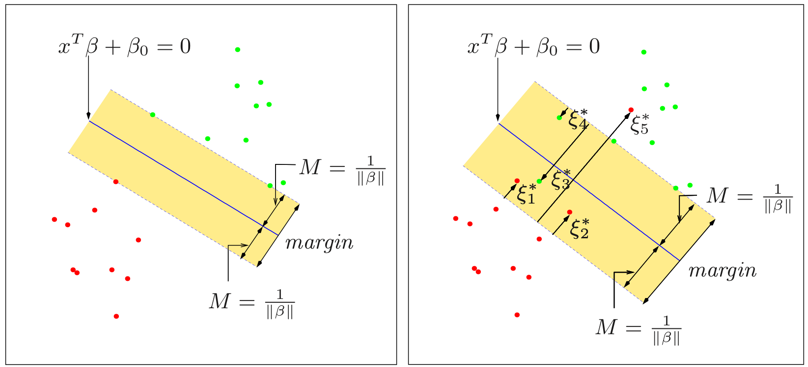
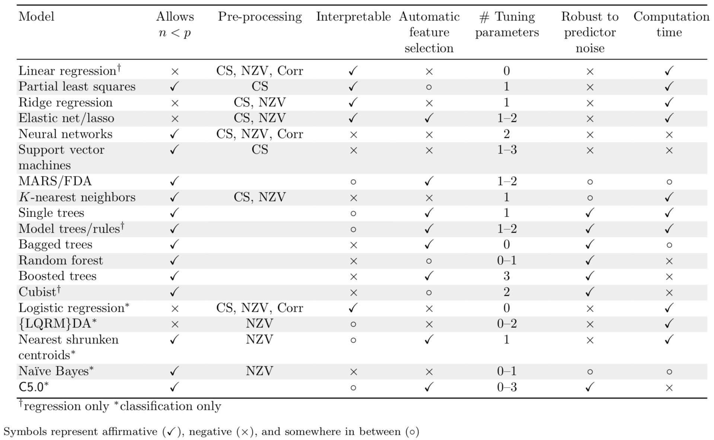
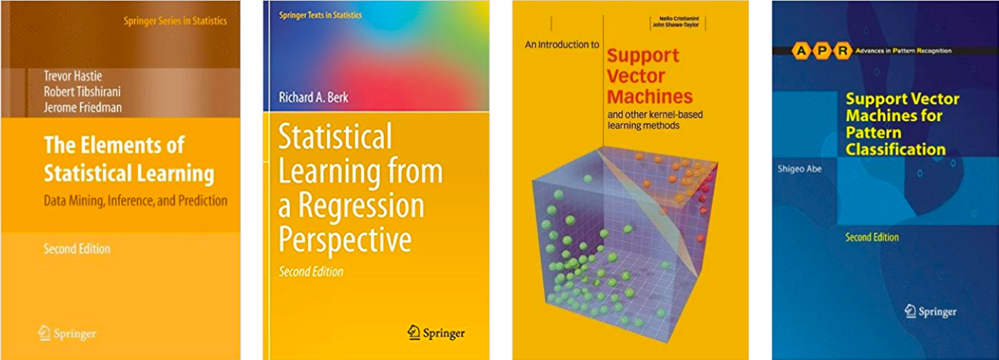

class: inverse, center

background-image: url(images/svm-smiley.png)
background-position: center
background-size: cover

# Support vector machines


---
class: inverse, center, middle

background-image: url(images/i_svm.jpg)
background-position: center
background-size: contain


---
class: middle

.pull-left[

.font125[

The usual introduction...`r emo::ji("scream")`

]

```{r svm-pseudo-code, echo=FALSE, out.width="100%"}

```

]

.pull-right[

```{r nope-nope, echo=FALSE, out.width="100%"}
RBitmoji::plot_comic("8b06e67b-d4e9-4f11-a355-f1236df17079-v1", 
                     tag = "nope nope")
```

]


---
class: center, middle

## A gentle introduction...


```{r 08-setup, include=FALSE}
# Set global R options
options(htmltools.dir.version = FALSE, servr.daemon = TRUE)

# Set global knitr chunk options
knitr::opts_chunk$set(
  dev = "svg",
  fig.align = "center",
  fig.path = "Figures/08-Figures/", 
  cache = TRUE,
  error = FALSE,
  message = FALSE, 
  warning = FALSE, 
  collapse = FALSE 
)

# Load required packages
library(earth)
library(kernlab)
library(MASS)
library(svmpath)

# Colors
dark2 <- RColorBrewer::brewer.pal(8, "Dark2")
set1 <- RColorBrewer::brewer.pal(9, "Set1")

# Plotting function modified from svmpath::svmpath()
plot_svmpath <- function(x, step = max(x$Step), main = "") {
  object = x
  f = predict(object, lambda = object$lambda[step], type = "function")
  x = object$x
  y = object$y
  Elbow = object$Elbow[[step]]
  alpha = object$alpha[, step]
  alpha0 = object$alpha0[step]
  lambda = object$lambda[step]
  x <- x[, 1:2]
  plotargs = list(x = x[, ], type = "n", xlab = "Income (standardized)", 
                  ylab = "Lot size (standardized)", main = main)
  do.call("plot", plotargs)
  dark2 <- RColorBrewer::brewer.pal(8, "Dark2")
  points(x, cex = 1.2, pch = c(17, 19)[ifelse(norm2d$y == 1, 1, 2)],
         col = adjustcolor(dark2[ifelse(norm2d$y == 1, 1, 2)], alpha.f = 0.5))
  beta <- (alpha * y) %*% x
  abline(-alpha0/beta[2], -beta[1]/beta[2], col = "black", lwd = 1)
  abline(lambda/beta[2] - alpha0/beta[2], -beta[1]/beta[2], 
         col = "black", lwd = 1, lty = 2)
  abline(-lambda/beta[2] - alpha0/beta[2], -beta[1]/beta[2], 
         col = "black", lwd = 1, lty = 2)
  points(x[Elbow, ], pch = 19, cex = 1.2)
}
```


---
class: center, middle

.font150[

Classification is all about finding a "good" [_decision boundary_](https://en.wikipedia.org/wiki/Decision_boundary)

]

```{r decision-boundaries, echo=FALSE, out.width="100%"}
knitr::include_graphics("images/decision_boundaries.png")
```


---

## Support vector machines (SVMs)

* .large[A direct approach to .red[binary] classification]:

    - Try to find a **hyperplane** in feature space that "best" separates the classes
    
* .large[In practice, it is difficult (if not impossible) to find a hyperplane to separate the classes in the original feature space]

--

.pull-left[

* .large[SVMs extend this idea in two ways:]

    - Relax/soften what we mean by separates
    
    - Use the [*kernel trick*](https://en.wikipedia.org/wiki/Kernel_method) to enlarge the feature space to the point that separation is (more) possible
    
]

.pull-right[

```{r 08-smiley, echo=FALSE, fig.width=7, fig.height=4, out.width="100%"}
# Setup for 1-by-2 grid of plots
par(mfrow = c(1, 2))

# Scatterplot of overlapping data
set.seed(101)
df <- as.data.frame(mlbench::mlbench.2dnormals(100))
plot(
  x.2 ~ x.1,
  data = df,
  cex = 1.2,
  pch = c(17, 19)[df$classes],
  col = adjustcolor(dark2[df$classes], alpha.f = 0.5),
  xlab = expression(X[1]),
  ylab = expression(X[2]),
  main = "Overlapping classes"
)

# Scatterplot of data with nonlinear decision boundary
set.seed(102)
df <- as.data.frame(mlbench::mlbench.spirals(300, cycles = 2, sd = 0.09))
plot(
  x.2 ~ x.1,
  data = df,
  cex = 1.2,
  pch = c(17, 19)[df$classes],
  col = adjustcolor(dark2[df$classes], alpha.f = 0.5),
  xlab = expression(X[1]),
  ylab = expression(X[2]),
  main = "Nonlinear decision boundary"
)
```

]


---

## Hyperplanes

.medium[

* A hyperplane in *p*-dimensional feature space is defined by the (linear) equation $$f\left(X\right) = \beta_0 + \beta_1 X_1 + \dots + \beta_p X_p = 0$$

  - For $p = 2$ the hyperplane is just a .red[line] in 2-D space
  
  - For $p = 3$ the hyperplane is a .red[plane] in 3-D space
  
* $f\left(X\right) > 0$ for points on one side of the hyperplane, and $f\left(X\right) < 0$ for points on the other side
  
* It is (mathematically) convenient to code the binary outcome using {-1, 1} so that $Y_i \times f\left(X_i\right) > 0$ for points on the correct side of the decision boundary!
    
]


---
class: inverse, center, middle

background-image: url(images/separable.jpg)
background-position: center
background-size: contain

# Seperable data


---

## Separating hyperplanes

.larger[

* For two separable classes, there are an infinite number of separating hyperplanes! `r emo::ji("scream")`

* What we want is a separating hyperplane with .red[good generalization performance]!

* The .red[*hard margin classifier*] (HMC) is an "optimal" separating hyperplane and the simplest type of SVM

]


---
class: center, middle

## The .red[*optimal separating hyperplane*] separates the two classes .red[and] maximizes the distance to the closest point from either class

.right[.large[-Vladimir Vapnik]]


---

```{r 08-separating-hyperplanes-01, echo=FALSE, fig.width=4, fig.height=4, out.width="80%"}
# Simulate data
set.seed(805)
norm2d <- as.data.frame(mlbench::mlbench.2dnormals(
  n = 100,
  cl = 2,
  r = 4,
  sd = 1
))
names(norm2d) <- c("x1", "x2", "y")  # rename columns

# Scatterplot
plot(
  formula = x2 ~ x1, 
  data = norm2d, 
  asp = 1,
  cex = 1.2,
  pch = c(17, 19)[norm2d$y],
  col = adjustcolor(dark2[norm2d$y], alpha.f = 0.5),
  xlab = "Income (standardized)",
  ylab = "Lot size (standardized)"
)
```


---

```{r 08-separating-hyperplanes-02, echo=FALSE, fig.width=4, fig.height=4, out.width="80%"}
# Fit a Logistic regression, linear discriminant analysis (LDA), and optimal
# separating hyperplane (OSH). Note: we sometimes refer to the OSH as the hard 
# margin classifier
fit_glm <- glm(as.factor(y) ~ ., data = norm2d, family = binomial)
fit_lda <- lda(as.factor(y) ~ ., data = norm2d)
invisible(capture.output(fit_hmc <- ksvm(  # use ksvm() to find the OSH
  x = data.matrix(norm2d[c("x1", "x2")]),
  y = as.factor(norm2d$y), 
  kernel = "vanilladot",  # no fancy kernel, just ordinary dot product
  C = Inf,                # to approximate hard margin classifier
  prob.model = TRUE       # needed to obtain predicted probabilities
)))

# Grid over which to evaluate decision boundaries
npts <- 500
xgrid <- expand.grid(
  x1 = seq(from = -6, 6, length = npts),
  x2 = seq(from = -6, 6, length = npts)
)

# Predicted probabilities (as a two-column matrix)
prob_glm <- predict(fit_glm, newdata = xgrid, type = "response")
prob_glm <- cbind("1" = 1 - prob_glm, "2" = prob_glm)
prob_lda <- predict(fit_lda, newdata = xgrid)$posterior
prob_hmc <- predict(fit_hmc, newdata = xgrid, type = "probabilities")

# Scatterplot
plot(
  formula = x2 ~ x1, 
  data = norm2d, 
  asp = 1,
  cex = 1.2,
  pch = c(17, 19)[norm2d$y],
  col = adjustcolor(dark2[norm2d$y], alpha.f = 0.5),
  xlab = "Income (standardized)",
  ylab = "Lot size (standardized)"
)

# Plot decision boundary: logistic regression
contour(
  x = sort(unique(xgrid$x1)), 
  y = sort(unique(xgrid$x2)), 
  z = matrix(prob_glm[, 1L], nrow = npts), 
  levels = 0.5,
  col = set1[1L], 
  drawlabels = FALSE, 
  lwd = 1,
  lty = 1,
  add = TRUE
)

# Plot decision boundary: LDA
contour(
  x = sort(unique(xgrid$x1)), 
  y = sort(unique(xgrid$x2)), 
  z = matrix(prob_lda[, 1L], nrow = npts), 
  levels = 0.5,
  col = set1[2L], 
  drawlabels = FALSE, 
  lwd = 1,
  lty = 1,
  add = TRUE
)

# Plot decision boundary: OSH
contour(
  x = sort(unique(xgrid$x1)), 
  y = sort(unique(xgrid$x2)), 
  z = matrix(prob_hmc[, 1L], nrow = npts), 
  levels = 0.5,
  col = set1[3L], 
  drawlabels = FALSE, 
  lwd = 1,
  lty = 1,
  add = TRUE
)

# Add plot legend
legend(
  x = "topleft",
  legend = c("Logistic regression", "LDA", "HMC"),
  col = set1[1L:3L],
  lty = 1,
  inset = 0.02,
  bty = "n",
  cex = 0.5
)
```


---
class: inverse, center, middle

background-image: url(images/explain.png)
background-position: center
background-size: contain


---

```{r 08-plot, echo=FALSE, fig.width=4, fig.height=4, out.width="80%"}
# Scatterplot
plot(
  formula = x2 ~ x1, 
  data = norm2d, 
  asp = 1,
  cex = 1.2,
  pch = c(17, 19)[norm2d$y],
  col = adjustcolor(dark2[norm2d$y], alpha.f = 0.5),
  xlab = "Income (standardized)",
  ylab = "Lot size (standardized)"
)
```


---

```{r 08-chull-02, echo=FALSE, fig.width=4, fig.height=4, out.width="80%"}
# Scatterplot
plot(
  formula = x2 ~ x1,
  data = norm2d, 
  asp = 1,
  cex = 1.2,
  pch = c(17, 19)[norm2d$y],
  col = adjustcolor(dark2[norm2d$y], alpha.f = 0.5),
  xlab = "Income (standardized)",
  ylab = "Lot size (standardized)"
)

# Plot convex hull for each class
hpts1 <- chull(norm2d[norm2d$y == 1, c("x1", "x2")])
hpts1 <- c(hpts1, hpts1[1L])
hpts2 <- chull(norm2d[norm2d$y == 2, c("x1", "x2")])
hpts2 <- c(hpts2, hpts2[1L])
lines(norm2d[norm2d$y == 1, c("x1", "x2")][hpts1, c("x1", "x2")])
lines(norm2d[norm2d$y == 2, c("x1", "x2")][hpts2, c("x1", "x2")])
```


---

```{r 08-chull-03, echo=FALSE, fig.width=4, fig.height=4, out.width="80%"}
# Scatterplot
plot(
  formula = x2 ~ x1,
  data = norm2d, 
  asp = 1,
  cex = 1.2,
  pch = c(17, 19)[norm2d$y],
  col = adjustcolor(dark2[norm2d$y], alpha.f = 0.5),
  xlab = "Income (standardized)",
  ylab = "Lot size (standardized)"
)

# Plot convex hull for each class
hpts1 <- chull(norm2d[norm2d$y == 1, c("x1", "x2")])
hpts1 <- c(hpts1, hpts1[1L])
hpts2 <- chull(norm2d[norm2d$y == 2, c("x1", "x2")])
hpts2 <- c(hpts2, hpts2[1L])
lines(norm2d[norm2d$y == 1, c("x1", "x2")][hpts1, c("x1", "x2")])
lines(norm2d[norm2d$y == 2, c("x1", "x2")][hpts2, c("x1", "x2")])

# Support vectors
sv <- norm2d[fit_hmc@alphaindex[[1L]], c("x1", "x2")]  # 16-th and 97-th observations
points(sv, pch = 19, cex = 1.2)
```


---

```{r 08-chull-04, echo=FALSE, fig.width=4, fig.height=4, out.width="80%"}
# Scatterplot
plot(
  formula = x2 ~ x1,
  data = norm2d, 
  asp = 1,
  cex = 1.2,
  pch = c(17, 19)[norm2d$y],
  col = adjustcolor(dark2[norm2d$y], alpha.f = 0.5),
  xlab = "Income (standardized)",
  ylab = "Lot size (standardized)"
)

# Plot convex hull for each class
hpts1 <- chull(norm2d[norm2d$y == 1, c("x1", "x2")])
hpts1 <- c(hpts1, hpts1[1L])
hpts2 <- chull(norm2d[norm2d$y == 2, c("x1", "x2")])
hpts2 <- c(hpts2, hpts2[1L])
lines(norm2d[norm2d$y == 1, c("x1", "x2")][hpts1, c("x1", "x2")])
lines(norm2d[norm2d$y == 2, c("x1", "x2")][hpts2, c("x1", "x2")])

# Support vectors
sv <- norm2d[fit_hmc@alphaindex[[1L]], c("x1", "x2")]  # 16-th and 97-th observations
points(sv, pch = 19, cex = 1.2)

# Add joining line segment
arrows(sv[1L, 1L], sv[1L, 2L], sv[2L, 1L], sv[2L, 2L], code = 3, length = 0.1)
```


---

```{r 08-chull-05, echo=FALSE, fig.width=4, fig.height=4, out.width="80%"}
# Scatterplot
plot(
  formula = x2 ~ x1,
  data = norm2d, 
  asp = 1,
  cex = 1.2,
  pch = c(17, 19)[norm2d$y],
  col = adjustcolor(dark2[norm2d$y], alpha.f = 0.5),
  xlab = "Income (standardized)",
  ylab = "Lot size (standardized)"
)

# Plot convex hull for each class
hpts1 <- chull(norm2d[norm2d$y == 1, c("x1", "x2")])
hpts1 <- c(hpts1, hpts1[1L])
hpts2 <- chull(norm2d[norm2d$y == 2, c("x1", "x2")])
hpts2 <- c(hpts2, hpts2[1L])
lines(norm2d[norm2d$y == 1, c("x1", "x2")][hpts1, c("x1", "x2")])
lines(norm2d[norm2d$y == 2, c("x1", "x2")][hpts2, c("x1", "x2")])

# Support vectors
sv <- norm2d[fit_hmc@alphaindex[[1L]], c("x1", "x2")]  # 16-th and 97-th observations
points(sv, pch = 19, cex = 1.2)

# Add joining line segment
arrows(sv[1L, 1L], sv[1L, 2L], sv[2L, 1L], sv[2L, 2L], code = 3, length = 0.1)

# Plot the OSH; that is, the perpendicular bisector of the line segment 
# joining the two support vectors
slope <- -1 / ((sv[2L, 2L] - sv[1L, 2L]) / (sv[2L, 1L] - sv[1L, 1L]))
midpoint <- apply(sv, 2, mean)
abline(
  a = -slope * midpoint[1L] + midpoint[2L], 
  b = slope
)
```


---

```{r 08-chull-06, echo=FALSE, fig.width=4, fig.height=4, out.width="80%"}
# Scatterplot
plot(
  formula = x2 ~ x1,
  data = norm2d, 
  asp = 1,
  cex = 1.2,
  pch = c(17, 19)[norm2d$y],
  col = adjustcolor(dark2[norm2d$y], alpha.f = 0.5),
  xlab = "Income (standardized)",
  ylab = "Lot size (standardized)"
)

# Plot convex hull for each class
hpts1 <- chull(norm2d[norm2d$y == 1, c("x1", "x2")])
hpts1 <- c(hpts1, hpts1[1L])
hpts2 <- chull(norm2d[norm2d$y == 2, c("x1", "x2")])
hpts2 <- c(hpts2, hpts2[1L])
lines(norm2d[norm2d$y == 1, c("x1", "x2")][hpts1, c("x1", "x2")])
lines(norm2d[norm2d$y == 2, c("x1", "x2")][hpts2, c("x1", "x2")])

# Support vectors
sv <- norm2d[fit_hmc@alphaindex[[1L]], c("x1", "x2")]  # 16-th and 97-th observations
points(sv, pch = 19, cex = 1.2)

# Add joining line segment
arrows(sv[1L, 1L], sv[1L, 2L], sv[2L, 1L], sv[2L, 2L], code = 3, length = 0.1)

# Plot the OSH; that is, the perpendicular bisector of the line segment 
# joining the two support vectors
slope <- -1 / ((sv[2L, 2L] - sv[1L, 2L]) / (sv[2L, 1L] - sv[1L, 1L]))
midpoint <- apply(sv, 2, mean)
abline(
  a = -slope * midpoint[1L] + midpoint[2L], 
  b = slope
)

# Plot margin boundaries
abline(
  a = -slope * sv[1L, 1L] + sv[1L, 2L], 
  b = slope,
  lty = 2
)
abline(
  a = -slope * sv[2L, 1L] + sv[2L, 2L], 
  b = slope,
  lty = 2
)
```


---

```{r 08-chull-07, echo=FALSE, fig.width=4, fig.height=4, out.width="80%"}
# Scatterplot
plot(
  formula = x2 ~ x1,
  data = norm2d, 
  asp = 1,
  cex = 1.2,
  pch = c(17, 19)[norm2d$y],
  col = adjustcolor(dark2[norm2d$y], alpha.f = 0.5),
  xlab = "Income (standardized)",
  ylab = "Lot size (standardized)"
)

# Plot convex hull for each class
hpts1 <- chull(norm2d[norm2d$y == 1, c("x1", "x2")])
hpts1 <- c(hpts1, hpts1[1L])
hpts2 <- chull(norm2d[norm2d$y == 2, c("x1", "x2")])
hpts2 <- c(hpts2, hpts2[1L])
lines(norm2d[norm2d$y == 1, c("x1", "x2")][hpts1, c("x1", "x2")])
lines(norm2d[norm2d$y == 2, c("x1", "x2")][hpts2, c("x1", "x2")])

# Support vectors
sv <- norm2d[fit_hmc@alphaindex[[1L]], c("x1", "x2")]  # 16-th and 97-th observations
points(sv, pch = 19, cex = 1.2)

# Add joining line segment
arrows(sv[1L, 1L], sv[1L, 2L], sv[2L, 1L], sv[2L, 2L], code = 3, length = 0.1)

# Plot the OSH; that is, the perpendicular bisector of the line segment 
# joining the two support vectors
slope <- -1 / ((sv[2L, 2L] - sv[1L, 2L]) / (sv[2L, 1L] - sv[1L, 1L]))
midpoint <- apply(sv, 2, mean)
abline(
  a = -slope * midpoint[1L] + midpoint[2L], 
  b = slope
)

# Plot margin boundaries
abline(
  a = -slope * sv[1L, 1L] + sv[1L, 2L], 
  b = slope,
  lty = 2
)
abline(
  a = -slope * sv[2L, 1L] + sv[2L, 2L], 
  b = slope,
  lty = 2
)

# Label margin
pBrackets::brackets(
  x2 = sv[1L, 1L]+0.5, 
  y2 = sv[1L, 2L]-0.5,
  x1 = midpoint[1L]+0.5,
  y1 = midpoint[2L]-0.5,
  type = 1,
  col = set1[1L],
  lwd = 2
)
text(1.5, -2.25, label = "M", col = set1[1L], srt = 40)
```


---

## The hard margin classifier `r emo::ji("scream")`

<br/>

.large[

$$\underset{\beta_0, \beta_1, \dots, \beta_p}{\text{maximize}} \quad M$$

$$\text{subject to:} \quad \begin{cases} \sum_{j = 1}^p \beta_j^2 = 1,\\ y_i\left(\beta_0 + \beta_1 x_{i1} + \dots + \beta_p x_{ip}\right) \ge M,\\ \quad \forall i = 1, 2, \dots, n \end{cases}$$
]

--

<br/>

.red[.center[.large[This is a quadratic programming problem with linear inequality constraints!!]]]


---
class: inverse, center, middle

# Sometimes perfect separation is achievable, but not desirable!

---

```{r 08-plot-again, echo=FALSE, fig.width=4, fig.height=4, out.width="80%"}
# Scatterplot
plot(
  formula = x2 ~ x1, 
  data = norm2d, 
  asp = 1,
  cex = 1.2,
  pch = c(17, 19)[norm2d$y],
  col = adjustcolor(dark2[norm2d$y], alpha.f = 0.5),
  xlab = "Income (standardized)",
  ylab = "Lot size (standardized)"
)
```


---

```{r 08-noisy-01, echo=FALSE, fig.width=4, fig.height=4, out.width="80%"}
# Add an outlier
norm2d <- rbind(norm2d, data.frame("x1" = 0.5, "x2" = 1, "y" = 2))

# Scatterplot
plot(
  formula = x2 ~ x1, 
  data = norm2d, 
  asp = 1,
  cex = 1.2,
  pch = c(17, 19)[norm2d$y],
  col = adjustcolor(dark2[norm2d$y], alpha.f = 0.5),
  xlab = "Income (standardized)",
  ylab = "Lot size (standardized)"
)

# Add an arrow pointing to the outlier
arrows(x0 = -1, y0 = 4, x1 = 0.5, y1 = 1, length = 0.1)
text(x = -1, y = 4, label = "Outlier?", pos = 3)
```


---

```{r 08-noisy-02, echo=FALSE, fig.width=4, fig.height=4, out.width="80%"}
# Fit a Logistic regression, linear discriminant analysis (LDA), and optimal
# separating hyperplane (OSH)
#
# Note: we sometimes refer to the OSH as the hard margin classifier
fit_glm <- glm(as.factor(y) ~ ., data = norm2d, family = binomial)
fit_lda <- lda(as.factor(y) ~ ., data = norm2d)
invisible(capture.output(fit_hmc <- ksvm(  # use ksvm() to find the OSH
  x = data.matrix(norm2d[c("x1", "x2")]),
  y = as.factor(norm2d$y), 
  kernel = "vanilladot",  # no fancy kernel, just ordinary dot product
  C = Inf,                # to approximate maximal margin classifier
  prob.model = TRUE       # needed to obtain predicted probabilities
)))

# Grid over which to evaluate decision boundaries
npts <- 500
xgrid <- expand.grid(
  x1 = seq(from = -6, 6, length = npts),
  x2 = seq(from = -6, 6, length = npts)
)

# Predicted probabilities (as a two-column matrix)
prob_glm <- predict(fit_glm, newdata = xgrid, type = "response")
prob_glm <- cbind("1" = 1 - prob_glm, "2" = prob_glm)
prob_lda <- predict(fit_lda, newdata = xgrid)$posterior
prob_hmc <- predict(fit_hmc, newdata = xgrid, type = "probabilities")

# Scatterplot
plot(
  formula = x2 ~ x1, 
  data = norm2d, 
  asp = 1,
  cex = 1.2,
  pch = c(17, 19)[norm2d$y],
  col = adjustcolor(dark2[norm2d$y], alpha.f = 0.5),
  xlab = "Income (standardized)",
  ylab = "Lot size (standardized)"
)

# Plot decision boundary: logistic regression
contour(
  x = sort(unique(xgrid$x1)), 
  y = sort(unique(xgrid$x2)), 
  z = matrix(prob_glm[, 1L], nrow = npts), 
  levels = 0.5,
  col = set1[1L], 
  drawlabels = FALSE, 
  lwd = 1,
  lty = 1,
  add = TRUE
)

# Plot decision boundary: LDA
contour(
  x = sort(unique(xgrid$x1)), 
  y = sort(unique(xgrid$x2)), 
  z = matrix(prob_lda[, 1L], nrow = npts), 
  levels = 0.5,
  col = set1[2L], 
  drawlabels = FALSE, 
  lwd = 1,
  lty = 1,
  add = TRUE
)

# Plot decision boundary: OSH
contour(
  x = sort(unique(xgrid$x1)), 
  y = sort(unique(xgrid$x2)), 
  z = matrix(prob_hmc[, 1L], nrow = npts), 
  levels = 0.5,
  col = set1[3L], 
  drawlabels = FALSE, 
  lwd = 1,
  lty = 1,
  add = TRUE
)

# Add plot legend
legend(
  x = "topleft",
  legend = c("Logistic regression", "LDA", "HMC"),
  col = set1[1L:3L],
  lty = 1,
  inset = 0.02,
  bty = "n",
  cex = 0.5
)
```


---

## The soft margin classifier `r emo::ji("scream")`

<br/>

.font125[

$$\underset{\beta_0, \beta_1, \dots, \beta_p}{\text{maximize}} \quad M$$

$$\text{subject to:} \quad \begin{cases} \sum_{j = 1}^p \beta_j^2 = 1,\\ y_i\left(\beta_0 + \beta_1 x_{i1} + \dots + \beta_p x_{ip}\right) \ge M\left(1 - \xi_i\right),\\ \quad \forall i = 1, 2, \dots, n\\ \xi_i \ge 0, \\ \sum_{i = 1}^n \xi_i \le C\end{cases}$$
]

--

<br/>

.red[.center[.large[This is a quadratic programming problem with linear inequality constraints!!]]]


---
class: center, middle

```{r 08-svm-classifiers, echo=FALSE, out.width="100%"}

```


---
class: center, middle

## $C$ is a regularization parameter 

```{r 08-noisy-path-01, echo=FALSE, fig.width=12, figh.height=3, out.width="100%"}
# Fit the entire regularization path
fit_smc <- svmpath(
  x = data.matrix(norm2d[c("x1", "x2")]), 
  y = ifelse(norm2d$y == 1, 1, -1)
)

# Plot both extremes
par(mfrow = c(1, 2))
plot_svmpath(fit_smc, step = min(fit_smc$Step), main = expression(C == 0))
plot_svmpath(fit_smc, step = max(fit_smc$Step), main = expression(C == infinity))
```


---
class: center, middle

<!--  -->


---
class: center, middle

### As it turns out, you can fit the entire regularization path with essentially the same cost as a single SVM fit! 

```{r hell-yeah, echo=FALSE, out.width="40%"}
RBitmoji::plot_comic("8b06e67b-d4e9-4f11-a355-f1236df17079-v1", tag = "volcano")
```


---
class: inverse, center, middle

background-image: url(images/non-separable.jpg)
background-position: center
background-size: contain

# Non-separable data


---

## The support vector machine

.large[

* The objective function for the soft margin classifier can be re-expressed as 

$$L_D = \sum_{i = 1}^n - \frac{1}{2}\sum_{i = 1}^n\sum_{i' = 1}^n \alpha_i\alpha_{i'}y_iy_{i'}x_i^{\top}x_{i'}$$

]

--

.large[

* In the SVM, we replace the .red[*dot product*] with a .red[*kernel function*]

$$L_D = \sum_{i = 1}^n - \frac{1}{2}\sum_{i = 1}^n\sum_{i' = 1}^n \alpha_i\alpha_{i'}y_iy_{i'}K\left(x_i, x_{i'}\right)$$

]


---
class: center, middle

.larger[Replacing the dot product with a kernel function is similar in spirit to .red[enlarging the feature space using basis functions] (e.g., like in MARS!)]


---

## Popular kernel functions

.larger[

* .magenta[*d*-th degree polynomial:] $$K\left(x, x'\right) = \left(1 + \langle x, x' \rangle\right) ^ d$$

* .magenta[Radial basis function:] $$K\left(x, x'\right) = \exp\left(\gamma \lVert x - x'\rVert ^ 2\right)$$

* .magenta[Hyperbolic tangent:] $$K\left(x, x'\right) = \tanh\left(k_1\lVert x - x'\rVert + k_2\right)$$

]


---
class: center, middle 

```{r 08-circle-01, echo=FALSE, fig.width=4 , fig.height=4, out.width="80%"}
# Simulate data
set.seed(1432)
circle <- as.data.frame(mlbench::mlbench.circle(
  n = 200,
  d = 2
))
names(circle) <- c("x1", "x2", "y")  # rename columns

# Scatterplot
# par(mar = c(5, 4, 0, 2) + 0.1)
plot(
  formula = x2 ~ x1,
  data = circle, 
  cex = 1.2,
  pch = c(17, 19)[circle$y],
  col = adjustcolor(dark2[circle$y], alpha.f = 0.5)
)
```


---
class: center, middle

.larger[

Enlarge the feature space by adding a third variable

$$X_3 = X_1^2 + X_2^2$$

]


---
class: center, middle

```{r 08-circle-02, echo=FALSE}
# Load required packages
library(plotly)

# Enlarge feature space
circle_3d <- circle
circle_3d$x3 <- circle_3d$x1^2 + circle_3d$x2^2

# 3-D scatterplot (enlarged feature space)
plot_ly(
  circle_3d, 
  x = ~x1, 
  y = ~x2, 
  z = ~x3, 
  color = ~y,
  colors = dark2[1L:2L]
)
```


---
class: center, middle

## The kernel trick

<iframe width="560" height="315" src="https://www.youtube.com/embed/3liCbRZPrZA" frameborder="0" allow="autoplay; encrypted-media" allowfullscreen></iframe>


---

```{r, 08-circle-boundaries, echo=FALSE, out.width="80%"}
# Fit a Logistic regression, quadratic discriminant analysis (QDA), and a 
# support vector machine (SVM)
fit_glm <- glm(as.factor(y) ~ x1 + x1 + I(x1^2) + I(x2^2), data = circle, 
               family = binomial)
fit_qda <- qda(as.factor(y) ~ ., data = circle)
fit_svm_poly <- ksvm( 
  x = data.matrix(circle[c("x1", "x2")]),
  y = as.factor(circle$y), 
  kernel = "polydot",       # polynomial kernel
  kpar = list(degree = 2),  # kernel parameters
  C = Inf,                  # to approximate maximal margin classifier
  prob.model = TRUE         # needed to obtain predicted probabilities
)
fit_svm_rbf <- ksvm( 
  x = data.matrix(circle[c("x1", "x2")]),
  y = as.factor(circle$y), 
  kernel = "rbfdot",        # polynomial kernel
  C = Inf,                  # to approximate maximal margin classifier
  prob.model = TRUE         # needed to obtain predicted probabilities
)

# Grid over which to evaluate decision boundaries
npts <- 500
xgrid <- expand.grid(
  x1 = seq(from = -1.25, 1.25, length = npts),
  x2 = seq(from = -1.25, 1.25, length = npts)
)

# Predicted probabilities (as a two-column matrix)
prob_glm <- predict(fit_glm, newdata = xgrid, type = "response")
prob_glm <- cbind("1" = 1 - prob_glm, "2" = prob_glm)
prob_qda <- predict(fit_qda, newdata = xgrid)$posterior
prob_svm_poly <- predict(fit_svm_poly, newdata = xgrid, type = "probabilities")
prob_svm_rbf <- predict(fit_svm_rbf, newdata = xgrid, type = "probabilities")

# Setup for 2-by-2 grid of plots
par(mfrow = c(2, 2))

# Plot decision boundary: logistic regression
plot(
  formula = x2 ~ x1, 
  data = circle, 
  cex = 1.2,
  pch = c(17, 19)[circle$y],
  col = adjustcolor(dark2[circle$y], alpha.f = 0.5),
  main = "Polynomial logistic regression"
)
contour(
  x = sort(unique(xgrid$x1)), 
  y = sort(unique(xgrid$x2)), 
  z = matrix(prob_glm[, 1L], nrow = npts), 
  levels = 0.5,
  col = "black", 
  drawlabels = FALSE, 
  lwd = 2,
  lty = 1,
  add = TRUE
)

# Plot decision boundary: QDA
plot(
  formula = x2 ~ x1, 
  data = circle, 
  cex = 1.2,
  pch = c(17, 19)[circle$y],
  col = adjustcolor(dark2[circle$y], alpha.f = 0.5),
  main = "QDA"
)
contour(
  x = sort(unique(xgrid$x1)), 
  y = sort(unique(xgrid$x2)), 
  z = matrix(prob_qda[, 1L], nrow = npts), 
  levels = 0.5,
  col = "black", 
  drawlabels = FALSE, 
  lwd = 2,
  lty = 1,
  add = TRUE
)

# Plot decision boundary: SVM (poly)
plot(
  formula = x2 ~ x1, 
  data = circle, 
  cex = 1.2,
  pch = c(17, 19)[circle$y],
  col = adjustcolor(dark2[circle$y], alpha.f = 0.5),
  main = "SVM: polynomial kernel"
)
contour(
  x = sort(unique(xgrid$x1)), 
  y = sort(unique(xgrid$x2)), 
  z = matrix(prob_svm_poly[, 1L], nrow = npts), 
  levels = 0.5,
  col = "black", 
  drawlabels = FALSE, 
  lwd = 2,
  lty = 1,
  add = TRUE
)

# Plot decision boundary: SVM (RBF)
plot(
  formula = x2 ~ x1, 
  data = circle,
  cex = 1.2,
  pch = c(17, 19)[circle$y],
  col = adjustcolor(dark2[circle$y], alpha.f = 0.5),
  main = "SVM: RBF kernel"
)
contour(
  x = sort(unique(xgrid$x1)), 
  y = sort(unique(xgrid$x2)), 
  z = matrix(prob_svm_rbf[, 1L], nrow = npts), 
  levels = 0.5,
  col = "black", 
  drawlabels = FALSE, 
  lwd = 2,
  lty = 1,
  add = TRUE
)
```


---

```{r 08-circle-mars, echo=FALSE, fig.width=4 , fig.height=4, out.width="80%"}
# Plot decision boundary: MARS (logit)
invisible(capture.output(
  fit_mars <- earth(as.factor(y) ~ x1 + x2, data = circle,
                    glm = list(family = binomial))
))
prob_mars <- predict(fit_mars, newdata = xgrid, type = "response")
plot(
  formula = x2 ~ x1,
  data = circle, 
  cex = 1.2,
  pch = c(17, 19)[circle$y],
  col = adjustcolor(dark2[circle$y], alpha.f = 0.5),
  main = "MARS: logit"
)
contour(
  x = sort(unique(xgrid$x1)), 
  y = sort(unique(xgrid$x2)), 
  z = matrix(prob_mars[, 1L], nrow = npts), 
  levels = 0.5,
  col = "black", 
  drawlabels = FALSE, 
  lwd = 2,
  lty = 1,
  add = TRUE
)
```


---

## Support vector machines

.large[

.pull-left[

#### .green[Advantages:]

* Maximization of generalizability

* Global optimum (.green[convex optimization problem])

* Robustness to outliers

* Incredibly flexible

]

.pull-right[

#### .red[Disadvantages:]

* Extension to more than two classes

* Doesn't scale well to large $N$ `r set.seed(105); emo::ji("sad")`

* Predicting .red[class probabilities] is not automatic

]

]


---

## More than two classes

.large[

* The SVM, as introduced, is .red[applicable to only two classes!]

* What do we do when we have more than two classes?

  - .orange.bold[*One-versus-all* (OVA):] Fit an SVM for each class (one class versus the rest); classify to the class with the largest; classify to the class for which the margin is the largest
  
  - .orange.bold[*One-versus-one* (OVO):] Fit all $\binom{\# \ classes}{2}$ pairwise SVMs; classify to the class that wins the most pairwise competitions

]


---

## Support vector regression

```{r 08-svr, echo=FALSE, fig.width=5, fig.height=4, out.width="80%"}
# Simulate data
set.seed(1218)
x <- seq(from = -20, to = 20, by = 0.1)
y <- sin(x) / x + rnorm(length(x), sd = 0.03)
plot(x, y, col = adjustcolor("black", alpha.f = 0.2), pch = 19, las = 1,
     xlab = expression(x), ylab = expression(sin(x) / x + epsilon))

# Support vector regression
fit <- ksvm(y ~ x, type = "eps-svr", epsilon = 0.01, kpar = list(sigm = 16),
            cross = 3)

# Plot fitted model
lines(x, predict(fit, newdata = x), lwd = 2, col = "red")
```


---
class: inverse, center, middle

# Fitting SVMs in R


---
class: center, middle

```{r 08-apm-summary, echo=FALSE, out.width="100%"}

```


---

## Lots of R packages available!!!

* [`e1071`](https://cran.r-project.org/package=e1071)

    - Provides an interface to the award-winning `libsvm` C++, a very efficient implementations of SVMs
    
* [`kernlab`](https://cran.r-project.org/package=kernlab)

    - More flexible implementation of SVMs with basic kernel functionality (**kern**al **lab**oratory), but still makes use of `libsvm` optimizers

* [`svmpath`](https://cran.r-project.org/package=svmpath)

    - Computes the entire regularization path for the two-class SVM classifier with essentially the same cost as a single SVM fit!

* [`LiblineaR`](https://cran.r-project.org/package=LiblineaR)

    - A wrapper around the `LIBLINEAR` C/C++ library for machine learning


---

## Two spirals benchmark problem

```{r 08-example-spirals-01}
# Load required packages
library(kernlab)  # for fitting SVMs
library(mlbench)  # for ML benchmark data sets  #<<

# Simulate train and test sets
set.seed(0841)
trn <- as.data.frame(
  mlbench.spirals(300, cycles = 2, sd = 0.09)
)
tst <- as.data.frame(
  mlbench.spirals(10000, cycles = 2, sd = 0.09)
)
names(trn) <- names(tst) <- c("x1", "x2", "classes")
```


---

```{r 08-example-spirals-02, echo=FALSE, fig.width=4, fig.height=4, out.width="80%"}
# Plot training data
plot(
  x2 ~ x1,
  data = trn,
  cex = 1.2,
  pch = c(17, 19)[trn$classes],
  col = adjustcolor(dark2[trn$classes], alpha.f = 0.5),
  xlab = expression(X[1]),
  ylab = expression(X[2])
)
```


---

## Two spirals benchmark problem

```{r 08-example-spirals-03}
# Fit an SVM using a radial basis function kernel
spirals_rbf <- ksvm(
  classes ~ x1 + x2, data = trn, 
  kernel = "rbfdot",  #<<
  C = 500,  # I just picked a value  #<<
  prob.model = TRUE   #<<
)
```


---

```{r 08-example-spirals-04, echo=FALSE, fig.width=4, fig.height=4, out.width="80%"}
# Grid over which to evaluate decision boundaries
npts <- 500
xgrid <- expand.grid(
  x1 = seq(from = -2, 2, length = npts),
  x2 = seq(from = -2, 2, length = npts)
)

# Predicted probabilities (as a two-column matrix)
spirals_svm_prob <- 
  predict(spirals_rbf, newdata = xgrid, type = "probabilities")

# Plot decision boundary
plot(
  x2 ~ x1,
  data = trn,
  cex = 1.2,
  pch = c(17, 19)[trn$classes],
  col = adjustcolor(dark2[trn$classes], alpha.f = 0.5),
  xlab = expression(X[1]),
  ylab = expression(X[2])
)
contour(
  x = sort(unique(xgrid$x1)), 
  y = sort(unique(xgrid$x2)), 
  z = matrix(spirals_svm_prob[, 1L], nrow = npts), 
  levels = 0.5,
  col = "black", 
  drawlabels = FALSE, 
  lwd = 1,
  lty = 1,
  add = TRUE
)
```


---

## Two spirals benchmark problem

```{r 08-example-spirals-05, out.width="60%"}
# Test set confusion matrix
(tab <- table(
  pred = predict(spirals_rbf, newdata = tst),  # predicted outcome
  obs = tst$classes                    # observed outcome
))

# Test set error
1 - sum(diag(tab)) / nrow(tst)
```


---
class: center, middle, inverse

background-image: url(images/tuning.jpg)

# Model tuning

???

Image credit: [imgflip](http://www.learntoplaymusic.com/blog/tune-guitar/)


---

## Using caret::getModelInfo()

.code80[

```{r 08-getModelInfo}
# Linear (i.e., ordinary inner product)
caret::getModelInfo("svmLinear")$svmLinear$parameters

# Polynomial kernel
caret::getModelInfo("svmPoly")$svmPoly$parameters

# Radial basis kernel
caret::getModelInfo("svmRadial")$svmRadial$parameters
```

]


---
class: center, middle

.larger[

Not so .red[`purrr`]fect, now be gone!

```{r purrr, eval=FALSE}
detach(package:purrr)
```

]


---

## Job attrition example

.code80[

```{r 08-attrition-01}
# Load required packages
library(caret)    # for classification and regression training
library(dplyr)    # for data wrangling
library(ggplot2)  # for more awesome plotting
library(rsample)  # for attrition data and data splitting
library(pdp)      # for PDPs

# Same setup as Naive Bayes module!  #<<

# Load the attrition data
attrition <- attrition %>%
  mutate(  # convert some numeric features to factors
    JobLevel = factor(JobLevel),
    StockOptionLevel = factor(StockOptionLevel),
    TrainingTimesLastYear = factor(TrainingTimesLastYear)
  )

# Train and test splits
set.seed(123)  # for reproducibility
split <- initial_split(attrition, prop = 0.7, strata = "Attrition")
trn <- training(split)
tst <- testing(split)
```

]


---
class: center, middle

## Choosing an evaluation metric is one of the most important tasks in any ML project!

```{r 08-what, echo=FALSE, out.width="50%"}
set.seed(101)  # for reproducibility
user_id <- "8b06e67b-d4e9-4f11-a355-f1236df17079-v1"  # your (unique) user ID
RBitmoji::plot_comic(user_id, tag = "cereal")
```


---

## Job attrition example

.code80[

```{r 08-attrition-02}
# Control params for SVM
ctrl <- trainControl(
  method = "cv", 
  number = 5, 
  classProbs = TRUE,                 #<<
  summaryFunction = twoClassSummary  #<<
)

# Tune an SVM
set.seed(1854)  # for reproducibility
attr_svm <- train(
  Attrition ~ ., 
  data = trn,
  method = "svmRadial",               #<<
  preProcess = c("center", "scale"),  #<<
  metric = "ROC",                     #<<
  trControl = ctrl,
  tuneGrid = data.frame(
    sigma = 0.008071434,              #<<
    C = seq(from = 0.1, to = 5, length = 30)
  )
)
```

]


---

## Job attrition example

```{r 08-attrition-03, fig.width=5, fig.height=3, out.width = "80%"}
# Plot tuning results
ggplot(attr_svm) + theme_light()
```


---

## Job attrition example

.pull-left[

* .large[`caret`'s `varImp()` function provides a .red[*filter-based variable importance*] measure:]

* .large[`vip` has something similar, but it is still experimental!]

```{r 08-attrition-04, eval=FALSE}
# Filter-based variable 
# importance scores
plot(varImp(attr_svm))
```

]

.pull-right[

```{r 08-attrition-05, echo=FALSE, out.width = "100%"}
# Filter-based variable 
# importance scores
plot(varImp(attr_svm))
```

]


---

## Job attrition example

.pull-left.code80[

```{r svm-attrition-vip-permute-01, eval=FALSE}
# Predicted probabilities
prob_fun <- function(object, newdata) {
  probs <- predict(
    object = object, 
    newdata = newdata, 
    type = "prob"
  )
  probs[, c(2, 1)]  # ref class first
}

# Permutation-based importance
vip::vip(
  object = attr_svm, 
  method = "permute", 
  nsim = 10,
  target = "Attrition", 
  train = trn, 
  metric = "auc", 
  reference_class = "Yes",
  pred_fun = prob_fun,
  num_features = ncol(trn) - 1
)
```

]

.pull-right[

```{r svm-attrition-vip-permute-02, echo=FALSE}
# Predicted probabilities
prob_fun <- function(object, newdata) {
  probs <- predict(
    object = object, 
    newdata = newdata, 
    type = "prob"
  )
  probs[, c(2, 1)]  # ref class first
}

# Permutation-based importance
vip::vip(
  object = attr_svm, 
  method = "permute", 
  nsim = 10,
  target = "Attrition", 
  train = trn, 
  metric = "auc", 
  reference_class = "Yes",
  pred_fun = prob_fun,
  num_features = ncol(trn) - 1
)
```

]


---

## Job attrition example

.pull-left[

```{r 08-attrition-06, eval=FALSE}
# Partial dependence plots
features <- c(
  "MonthlyIncome", 
  "TotalWorkingYears", 
  "OverTime", 
  "YearsAtCompany"
)
pdfs <- lapply(features, function(x) {
  autoplot(partial(attr_svm, pred.var = x, prob = TRUE)) +
    theme_light()
})
grid.arrange(
  grobs = pdfs,  #<<
  ncol = 2
)
```

]

.pull-right[

```{r 08-attrition-07, echo=FALSE, out.width = "100%"}
# Partial dependence plots
features <- c(
  "MonthlyIncome", 
  "TotalWorkingYears", 
  "OverTime", 
  "YearsAtCompany"
)
pdfs <- lapply(features, function(x) {
  autoplot(pdp::partial(attr_svm, pred.var = x, prob = TRUE)) +
    theme_light()
})
grid.arrange(
  grobs = pdfs,  #<<
  ncol = 2
)
```

]


---

## Job attrition example

.pull-left[

```{r 08-attrition-08, eval=FALSE}
# Load required packages
library(pROC)  #<<

# Plot train and test ROC curves
roc_trn <- roc(  # train AUC: 0.9717
  predictor = predict(attr_svm, newdata = trn, type = "prob")$Yes, 
  response = trn$Attrition,
  levels = rev(levels(trn$Attrition))
)
roc_tst <- roc(  # test AUC: 0.8567
  predictor = predict(attr_svm, newdata = tst, type = "prob")$Yes, 
  response = tst$Attrition,
  levels = rev(levels(tst$Attrition))
)
plot(roc_trn)
lines(roc_tst, col = "dodgerblue2")
legend("bottomright", legend = c("Train", "Test"), bty = "n", cex = 2.5,
       col = c("black", "dodgerblue2"), inset = 0.01, lwd = 2)
```

]

.pull-right[

```{r 08-attrition-09, echo=FALSE, out.width="100%"}
# Load required packages
library(pROC)

# Plot train and test ROC curves
roc_trn <- roc(  # train AUC: 0.9717
  predictor = predict(attr_svm, newdata = trn, type = "prob")$Yes, 
  response = trn$Attrition,
  levels = rev(levels(trn$Attrition))
)
roc_tst <- roc(  # test AUC: 0.8567
  predictor = predict(attr_svm, newdata = tst, type = "prob")$Yes, 
  response = tst$Attrition,
  levels = rev(levels(tst$Attrition))
)
plot(roc_trn)
lines(roc_tst, col = "dodgerblue2")
legend("bottomright", legend = c("Train", "Test"), bty = "n", cex = 2.5,
       col = c("black", "dodgerblue2"), inset = 0.01, lwd = 2)
```

]


---
class: center, middle, inverse

background-image: url(images/your-turn.jpg)
background-position: center
background-size: contain

???

Image credit: [imgflip](https://imgflip.com/)


---
class: middle

.large[

Retune the previous model using a polynomial kernel. What is the test ROC for your final model? Which features seem to be the most important?

**Hint:** Use .red[`method = "svmPoly"`] in the call to .red[`caret::train()`] and be sure to update the .red[`tuneGrid`] argument accordingly.

]


---
class: middle

```{r 08-solution-01}
# Retune model using polynomial kenel
set.seed(1720)  # for reproducibility  #<<
attr_svm_poly <- train(
  Attrition ~ ., 
  data = trn,
  method = "svmPoly",                  #<<
  preProcess = c("center", "scale"),   #<<
  metric = "ROC",                      #<<
  trControl = ctrl,
  tuneGrid = data.frame(
    degree = 1:3, 
    scale = 1,
    C = seq(from = 0.1, to = 5, length = 30)
  )
)
```


---
class: middle

```{r 08-solution-02, eval=FALSE}
# Updated ROC curve
roc_tst_poly <- roc(  # test AUC: 0.8567
  predictor = predict(attr_svm_poly, newdata = tst, 
                      type = "prob")$Yes, 
  response = tst$Attrition,
  levels = rev(levels(tst$Attrition))
)
plot(roc_tst_poly, col = set1[1L])
lines(roc_tst, col = "dodgerblue2")
legend(
  x = "bottomright", 
  legend = c("Test (Poly)", "Test (RBF)"), 
  bty = "n", 
  cex = 1.5,
  col = set1[1L:2L], 
  inset = 0.01, 
  lwd = 2
)
```


---
class: middle, center

```{r 08-solution-03, echo=FALSE, fig.width=5, fig.height=5, out.width="80%"}
# Updated ROC curve
roc_tst_poly <- roc(  # test AUC: 0.8567
  predictor = predict(attr_svm_poly, newdata = tst, 
                      type = "prob")$Yes, 
  response = tst$Attrition,
  levels = rev(levels(tst$Attrition))
)
plot(roc_tst_poly, col = set1[1L])
lines(roc_tst, col = "dodgerblue2")
legend(
  x = "bottomright", 
  legend = c("Test (Poly)", "Test (RBF)"), 
  bty = "n", 
  cex = 1.5,
  col = set1[1L:2L], 
  inset = 0.01, 
  lwd = 2
)
```


---

## Additional resources

```{r 08-svm-books, echo=FALSE, out.width="100%"}

```

<br/>

* .larger[[Fitting the entire regularization path](http://www.jmlr.org/papers/volume5/hastie04a/hastie04a.pdf)]


---

background-image: url(images/questions-dr-evil.jpg)
background-position: center
